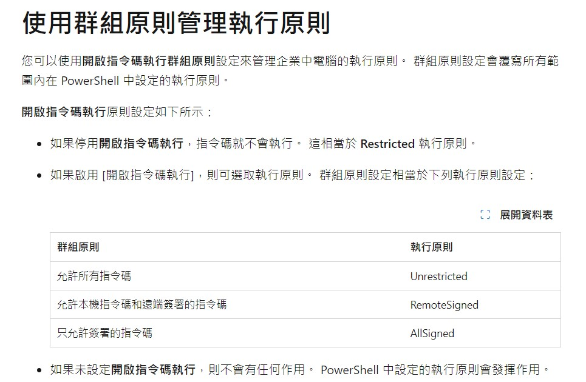

# 問題
在執行 Windows PowerShell 的 .ps1 指令稿時，出現「系統上已停用指令碼執行」的錯誤訊息，該如何解決？
``` powershell
請參閱 about_Execution_Policies，網址為 https:/go.microsoft.com/fwlink/?LinkID=135170。
位於 線路:1 字元:1
+ hexo init blog
+ ~~~~
    + CategoryInfo          : SecurityError: (:) [], PSSecurityException
    + FullyQualifiedErrorId : UnauthorizedAccess
```

# 解法
以系統管理員身分執行PowerShell輸入下列指令，並選擇Y確認。
``` powershell
Set-ExecutionPolicy RemoteSigned
```

## 微軟的官方說明


# 參考來源
1. https://learn.microsoft.com/zh-tw/powershell/module/microsoft.powershell.core/about/about_execution_policies?view=powershell-7.4
2. https://officeguide.cc/powershell-set-execution-policy-remote-signed/#google_vignette