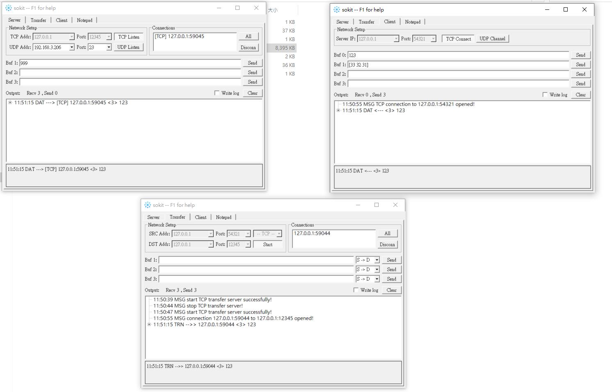

+++
title = "Sokit - A Powerful TCP/UDP Testing Tool You Should Know"
date= "2024-03-21T11:09:39+08:00"
categories=["share"]
tags=["tool","share"]
+++

Looking for an easy-to-use TCP/UDP testing tool? Sokit is a lightweight but powerful solution that helps you test network communications with ease. 

## ✨ Key Features

- TCP/UDP Server simulation (supports both string and hex formats)
- TCP/UDP Client simulation (supports both string and hex formats)
- Data forwarding/proxy capabilities
- Cross-platform support (Windows & Linux)
- Clean and intuitive UI

## 🔗 Quick Links
- [GitHub Repository](https://github.com/sinpolib/sokit)
- [Download Link](https://mega.nz/file/1l9AzS4Q#Q-D9Slf4O52bOtmkjYawedvQR4GxyfRi0hj7svkUHR4)

## 📖 Quick Start Guide

### Basic Server-Client Communication

1. Launch two instances of Sokit - one as TCP Server (left) and one as TCP Client (right)
2. Configure IP addresses and ports for both instances
3. Establish the connection between them

#### Testing Basic Communication:
- Send "123" from Client to Server
- Server receives the string
- Server can select specific client from the Connection list
- Send "999" back to Client from Server

### 🔢 Hex Communication Mode

1. Client can send hex data like [33 32 31] to Server
   > Note: Hex data must be enclosed in square brackets [ ]

2. Server can expand received data to show hex representation

### 🔄 Data Forwarding Setup

1. Launch a third Sokit instance as forwarding server with:
   - Source: 127.0.0.1:54321
   - Destination: 127.0.0.1:12345

2. When client connects to the forwarding server's source address, traffic will be automatically forwarded to the destination server

## 💡 Pro Tips

- Use hex mode for binary protocol testing
- Forwarding feature is great for debugging proxy scenarios
- Save common configurations for quick reuse
- Monitor traffic in real-time with the built-in logger

## 🛠 Perfect For

- Network protocol testing
- IoT device communication debugging
- API endpoint verification
- Network proxy testing
- Educational purposes

Give Sokit a try - it might become your go-to networking tool! Feel free to star the project on GitHub if you find it useful.