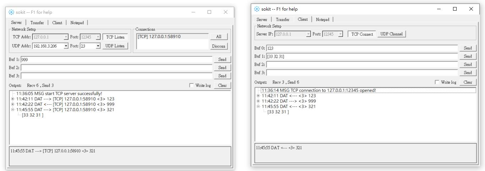
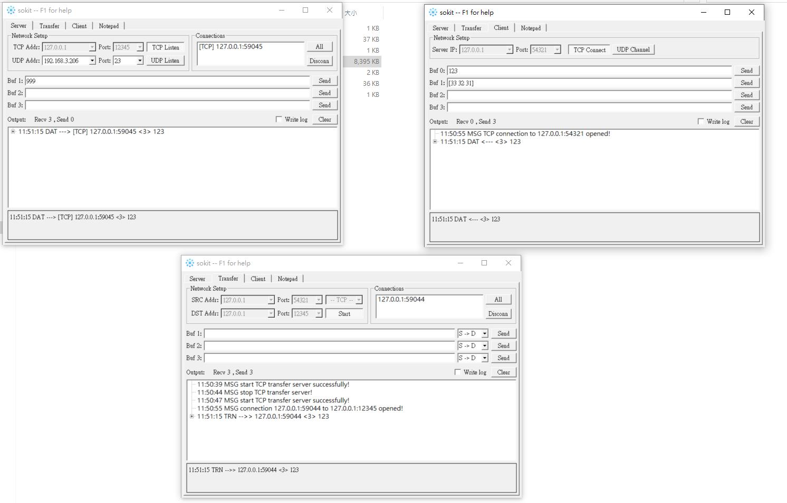

優點特性:

 - 模擬TCP/UDP server (字串或是Hex皆可)
 - 模擬TCP/UDP Client (字串或是Hex皆可)
 - 轉發功能
  
[Github專案](https://github.com/sinpolib/sokit)  [載點](https://mega.nz/file/1l9AzS4Q#Q-D9Slf4O52bOtmkjYawedvQR4GxyfRi0hj7svkUHR4)

### 建立Server-Client:

1. 開啟兩隻程式(如下圖)，一隻模擬TCP Server(左)，一隻模擬TCP Client(右)。

2. 設定好要使用的IP+PORT，並互相建立連線。

3. Client送出字串123，Server接收到字串。

4. Server指定Connection列表中的Client目標，並送出999給Client，Client接收到Server送來的字串999。

### HEX通訊

1. Client送出Hex資料[33 32 31]給Server。(注意:如果要送Hex資料需要使用[ ]將資料包起來)

2. Server可以將資料展開，將會把資料由字串改成Hex表示。

### 轉發測試
1. 轉發測試時，多開啟一隻程式設定成轉發Server。

   來源設定成127.0.0.1:54321，目標設定127.0.0.1:12345

2. Client連結到轉發Server的來源位置，建立連線時，將會透過傳發Server連到目標Server。

